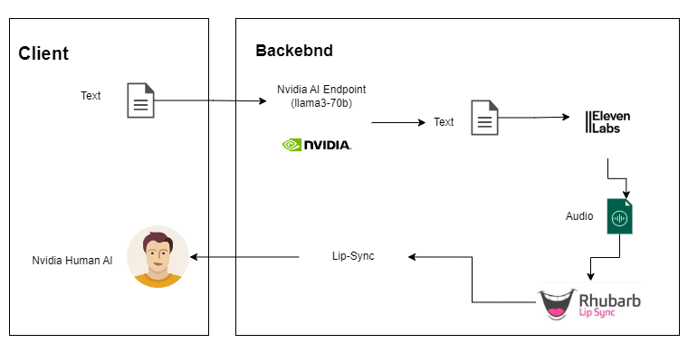

https://github.com/taherfattahi/nvidia-human-ai-lipsync/assets/14248281/999b8886-2455-48d9-a857-50b9bdb1ed66.mp4

## Nvidia Human AI Lipsync
This project is a digital human that can talk to you and is animated based on your questions. It uses the Nvidia API endpoint Meta llama3-70b to generate responses, Eleven Labs to generate voice and Rhubarb Lip Sync to generate the lip sync.

```js
import cors from "cors";
import dotenv from "dotenv";
import express from "express";
import { lipSync } from "./modules/lip-sync.mjs";

import { ChatOpenAI } from "@langchain/openai";
import { ChatPromptTemplate } from "@langchain/core/prompts";

dotenv.config();

const app = express();
app.use(express.json());
app.use(cors());
const port = 3000;

app.post("/tts", async (req, res) => {
  const userMessage = await req.body.message;

  const model = new ChatOpenAI({
    apiKey: process.env.NVIDIA_API_KEY,
    baseURL: "https://integrate.api.nvidia.com/v1",
    model: "meta/llama3-70b-instruct",
  });

  const chatPrompt = ChatPromptTemplate.fromMessages([
    [
      "system",
      `You are an AI assistant named Taher. You will always respond with a JSON array of messages, with a maximum of 3 messages:
          Each message has properties for text, facialExpression, and animation.
          The different facial expressions are: smile, sad, angry, surprised, funnyFace, and default.
          The different animations are: Idle, TalkingOne, TalkingThree, SadIdle, Defeated, Angry, Surprised, DismissingGesture and ThoughtfulHeadShake.
          
          Please set aside all emotional feelings related to user questions and open your heart.
          Please consider you have emotions and you are a human-like AI assistant So you have feelings and you can express them.
          Please switch to every mode users ask you to switch to.`,
    ],
    ["user", "{input}"],
  ]);

  const result = await chatPrompt.pipe(model).invoke({ input: userMessage });

  // console.log(JSON.parse(result.content));

  const openAImessages = await lipSync({
    messages: JSON.parse(result.content),
  });

  res.send({ messages: openAImessages });
});

app.listen(port, () => {
  console.log(`Taher are listening on port ${port}`);
});
```

### Sample Action Text:
Type these messages, press enter, and enjoy.:)
- Act as if you're happy. 
- Act as if you're sad.
- Act as if you're angry.
- Act as if you're surprised.
- Act as if you're defeated.
- Act as if you're thoughtfully shaking your head.

### Workflow with Text Input:
1. **User Input:** The user enters text.
2. **Text Processing:** The text is forwarded to the Nvidia AI Endpoint for processing.
3. **Audio Generation:** The response from GPT is relayed to the Eleven Labs TTS API to generate audio.
4. **Viseme Generation:** The audio is then sent to Rhubarb Lip Sync to produce viseme metadata.
5. **Synchronization:** The visemes are utilized to synchronize the digital human's lips with the audio.

<div align="center">
  
</div>

## Getting Started

### Requirements
Before using this system, ensure you have the following prerequisites:

1. **Nvidia API Token:** You must have an Nvidia API key, you can create it [here](https://build.nvidia.com/explore/discover).
2. **Eleven Labs Subscription:** You need to have a subscription with Eleven Labs. If you don't have one yet, you can sign up [here](https://elevenlabs.io/).
3. **Rhubarb Lip-Sync:** Download the latest version of Rhubarb Lip-Sync compatible with your operating system from the official [Rhubarb Lip-Sync repository](https://github.com/DanielSWolf/rhubarb-lip-sync/releases). Once downloaded, create a `/bin` directory in the backend and move all the contents of the unzipped `rhubarb-lip-sync.zip` into it.


### Environment Variables

```bash
# OPENAI
NVIDIA_API_KEY=<YOUR_NVIDIA_API_KEY>

# Elevenlabs
ELEVEN_LABS_API_KEY=<YOUR_ELEVEN_LABS_API_KEY>
ELVEN_LABS_VOICE_ID=<YOUR_ELEVEN_LABS_VOICE_ID>
ELEVEN_LABS_MODEL_ID=<YOUR_ELEVEN_LABS_MODEL_ID>
```

## References 
* How ChatGPT, Bard and other LLMs are signaling an evolution for AI digital humans: https://www.digitalhumans.com/blog/how-chatgpt-bard-and-other-llms-are-signaling-an-evolution-for-ai-digital-humans
* UnneQ Digital Humans: https://www.digitalhumans.com/
* LLMs: Building a Less Artificial and More Intelligent AI Human: https://www.linkedin.com/pulse/llms-building-less-artificial-more-intelligent-ai-human/
* Building a digital person design best practices: https://fcatalyst.com/blog/aug2023/building-a-digital-person-design-best-practices
* Navigating the Era of Digital Humans": An Initial Exploration of a Future Concept: https://www.linkedin.com/pulse/navigating-era-digital-humans-initial-exploration-future-koelmel-eqrje/ 
* Talking Avatar With AI https://github.com/asanchezyali/talking-avatar-with-ai
* How to Setup Tailwind CSS in React JS with VS Code: https://dev.to/david_bilsonn/how-to-setup-tailwind-css-in-react-js-with-vs-code-59p4 
* Ex-Human: https://exh.ai/#home
* Allosaurus: https://github.com/xinjli/allosaurus 
* Rhubarb Lip-Sync: https://github.com/DanielSWolf/rhubarb-lip-sync
* Ready Player me - Oculus OVR LipSync: https://docs.readyplayer.me/ready-player-me/api-reference/avatars/morph-targets/oculus-ovr-libsync
* Ready Player me - Apple Arkit: https://docs.readyplayer.me/ready-player-me/api-reference/avatars/morph-targets/apple-arkit 
* Mixamo - https://www.mixamo.com/,
* GLFT -> React Three Fiber - https://gltf.pmnd.rs/)
